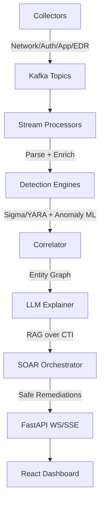

# SENTRIX LIVE++ – AI Cyber Threat Intelligence, Detection & SOAR

A production-grade, real-time, LLM-augmented SOC platform that ingests live security telemetry, detects anomalies, correlates with CTI, explains risks in natural language, and orchestrates safe auto-remediation.

## Architecture



### Detailed Architecture


```
┌─────────────────────────────────────────────────────────────────────────┐
│                        SENTRIX LIVE++ Architecture                       │
├───────────────┬───────────────┬───────────────────┬────────────────────┤
│ Frontend      │ Backend       │ Data Processing   │ Security           │
├───────────────┼───────────────┼───────────────────┼────────────────────┤
│ React         │ FastAPI       │ Kafka             │ LLM Guardrails     │
│ Material UI   │ WebSockets    │ Stream Parsers    │ SOAR Playbooks     │
│ Redux         │ SSE           │ Elasticsearch     │ CTI Integration    │
│ Data Grid     │ Redis         │ Detection Engines │ Anomaly Detection  │
└───────────────┴───────────────┴───────────────────┴────────────────────┘
```

The SENTRIX LIVE++ platform integrates multiple components:

1. **Data Collection & Processing**
   - Stream parsers for various log formats (Syslog, JSON, CEF)
   - Kafka for high-throughput message processing
   - Real-time event correlation engine

2. **AI & Intelligence**
   - LLM-powered security event explanation with guardrails
   - RAG over CTI data for context-aware analysis
   - Structured output validation for reliable insights

3. **Response & Orchestration**
   - SOAR playbooks with approval workflows
   - Automated remediation actions with safety checks
   - Audit logging of all actions

## Features

- **Real-time Ingestion**: Kafka-based streaming pipeline for security telemetry
- **Multi-source Collection**: Suricata/Zeek logs, syslog, cloud audit logs
- **Advanced Detection**: Sigma rules, YARA scanning, ML anomaly detection
- **LLM-powered Analysis**: Threat explanation with RAG over CTI
- **Secure SOAR**: Safe action runners with guardrails
- **Interactive UI**: Real-time dashboards with WebSocket/SSE streaming

## Quickstart

```bash
# Clone the repository
git clone https://github.com/your-org/sentrix-live-plus.git
cd sentrix-live-plus

# Set up environment variables
cp .env.example .env
# Edit .env with your configuration

# Start the platform
docker-compose up
```

## Demo Users

- Admin: admin@sentrix.io / Password: admin123
- Analyst: analyst@sentrix.io / Password: analyst123
- Viewer: viewer@sentrix.io / Password: viewer123

## Safety Features

- LLM Guardrails: Prompt-injection defense, content filters, context separators
- SOAR Safety: Dry-run capability, allow-list playbooks, no raw command execution
- PII Protection: Automatic scrubbing of sensitive information
- Comprehensive Audit: All actions logged and reviewable

## Code Explanation

### Core Components and Their Functions

#### Backend Structure
- **API Routes (`backend/api/routes/`)**: Handles all HTTP endpoints for alerts, SOAR actions, and user management. These routes are critical for enabling frontend-backend communication and external system integration.

- **Core Modules (`backend/core/`)**: 
  - `auth.py`: Implements JWT-based authentication with role-based access control
  - `config.py`: Centralizes configuration management with environment variable support
  - `db.py`: Provides database connection pooling and query abstractions
  - `ws.py`: Manages WebSocket connections for real-time updates to the dashboard

#### Security Intelligence
- **CTI Integration (`backend/cti/`)**: 
  - `taxii_client.py`: Connects to TAXII servers to fetch the latest threat intelligence
  - `rag_indexer.py`: Creates vector embeddings of CTI data for retrieval-augmented generation
  - `enrichers.py`: Enhances security events with additional context from threat intelligence

- **LLM Components (`backend/llm/`)**: 
  - `guardrails.py`: Implements critical security controls for LLM interactions:
    - Prevents prompt injection attacks
    - Detects and redacts sensitive data (PII)
    - Validates structured outputs against schemas
    - Enforces rate limits and relevance checks
  - `explainer.py`: Translates complex security events into human-readable explanations using:
    - RAG over threat intelligence data
    - Context-aware prompt engineering
    - Structured output parsing

#### Detection & Analysis
- **Detection Engines (`backend/detections/`)**: 
  - `sigma_engine.py`: Applies Sigma rules to detect known attack patterns
  - `yara_scan.py`: Scans files and memory for malicious patterns
  - `anomaly_iforest.py`: Uses Isolation Forest algorithm to detect unusual behavior

- **Stream Processing (`backend/stream/`)**: 
  - `kafka_consumer.py`: Consumes security events from Kafka topics
  - `parsers_*.py`: Normalizes various log formats (Suricata, Zeek, syslog) into a standard schema

#### Response Automation
- **SOAR Engine (`backend/soar/`)**: 
  - `engine.py`: Orchestrates automated response actions
  - `playbooks.py`: Defines response workflows for different alert types
  - `handlers.py`: Implements safe action runners with guardrails
  - `templates.py`: Provides templated responses for common security incidents

#### Frontend Components
- **React Dashboard (`frontend/src/`)**: 
  - `components/`: Reusable UI elements for alerts, events, and actions
  - `pages/`: Main application views (dashboard, alerts, investigations)
  - `App.js`: Main application component with routing and authentication
  - `theme.js`: Consistent styling across the application

### Why This Architecture Matters

1. **Security-First Design**: The LLM guardrails and SOAR safety checks prevent AI-related vulnerabilities and ensure that automated actions don't cause harm.

2. **Real-Time Processing**: The Kafka-based streaming architecture enables processing thousands of events per second with minimal latency, critical for detecting attacks as they happen.

3. **Explainable Security**: The LLM explainer bridges the gap between raw security data and actionable insights, making complex threats understandable to analysts of all experience levels.

4. **Automated Response**: The SOAR engine reduces mean time to remediation (MTTR) by automating common response actions while maintaining appropriate human oversight.

5. **Scalable and Resilient**: The microservices architecture allows independent scaling of components based on load, with no single point of failure.

### How It Works

1. **Data Flow**:
   - Security logs from various sources are ingested into Kafka topics
   - Stream parsers normalize the data into a standard format
   - Detection engines apply rules and ML models to identify threats
   - The correlator links related events into meaningful incidents
   - The LLM explainer provides human-readable analysis with CTI context
   - The SOAR orchestrator executes appropriate response actions
   - Real-time updates are pushed to the dashboard via WebSockets

2. **AI Integration**:
   - LLMs are used to explain security events in natural language
   - Retrieval-augmented generation (RAG) incorporates the latest threat intelligence
   - Guardrails prevent prompt injection and ensure output quality
   - Structured output validation ensures machine-readable results for automation

3. **Security Controls**:
   - All LLM interactions are validated, sanitized, and audited
   - SOAR actions are restricted to pre-approved, safe operations
   - PII is automatically detected and redacted from logs and reports
   - All actions are logged for compliance and forensic purposes

This architecture represents a significant advancement in security operations, combining the analytical power of AI with the speed of automation while maintaining strict security controls.

## License

MIT#
